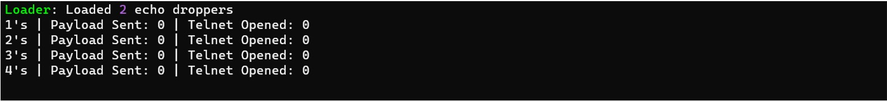

# AT&T AlienLabs обнаружила новый вредонос на Golang (BotenaGo), нацеленный на миллионы маршрутизаторов и IoT-устройств более чем 30 эксплойтами

##### 11 Ноября, 2021 | [Ofer Caspi](https://cybersecurity.att.com/blogs/author/ofer-caspi)
[Original link](https://cybersecurity.att.com/blogs/labs-research/att-alien-labs-finds-new-golang-malwarebotenago-targeting-millions-of-routers-and-iot-devices-with-more-than-30-exploits)
### Краткий обзор
AT&T Alien Labs™ нашли новый вредонос написанный на Open Source языке Golang. Развёрнутый с более чем 30 эксплойтами, он потенциально может быть нацелен на миллионы маршрутизаторов и IoT устройств.

### Ключевые выводы:
* BotenaGo имеет более 30 различных эксплоит-функций для атаки цели.
* Вредонос создаёт бэкдор и ожидает либо получения цели для атаки от удаленного оператора через порт 19412, либо от другого связанного модуля, работающего на той же машине.
* Пока неясно, какой субъект угрозы стоит за вредоносным ПО и количеством зараженных устройств

### Предистория

[Golang](https://go.dev/) (так же известный как Go) язык программирования с открытым исходным кодом разработан Google и впервые опубликован в 2007 году, который облегчает разработчикам создание ПО.

Согласно недавнему сообщению Intezer, за последние несколько лет популярность языка программирования Go среди авторов вредоносных программ резко возросла. [Сайт](https://www.intezer.com/blog/malware-analysis/year-of-the-gopher-2020-go-malware-round-up/) предполагает, что количество вредоносных программ, написанных на Go, в мире увеличилось на 2000%.

Некоторые из причин его растущей популярности связаны с простотой компиляции одного и того же кода для разных систем, что облегчает злоумышленникам распространение вредоносного ПО в нескольких операционных системах.

На момент публикации этой статьи у БотенаГо в настоящее время [низкий уровень обнаружения антивируса (AV)](https://www.virustotal.com/gui/file/0c395715bfeb8f89959be721cd2f614d2edb260614d5a21e90cc4c142f5d83ad): известно только 6/62, как показано в VirusTotal: (рисунок 1)

Рисунок 1. Результат сканирования на VirusTotal вредоноса BotenaGo

Некоторые AV из результатов распознают вредонос как новый вариант вредоноса Mirai, использующий Go — ссылки на полезную нагрузку действительно выглядят аналогично. Однако существует разница между вредоносом Mirai и новыми вариантами вредоносов, использующими Go, включая различия в языке, на котором оно написано, и архитектуре вредоносных программ. Mirai - это ботнет, который инициирует связь со своим командованием и управлением (C&C). Он также обладает различными функциями DDoS-атаки. Новые штаммы вредоносных программ, обнаруженные Alien Labs, не обладают теми же функциями атаки, что и вредонос Mirai, и новые штаммы ищут только уязвимые системы для распространения своей полезной нагрузки. Кроме того, Mirai использует “таблицу XOR” для хранения своих строк и других данных, а также для их расшифровки при необходимости — это не относится к новому вредоносу , использующему Go. По этой причине Alien Labs считает, что эта угроза является новой, и мы назвали ее BotenaGo.

### Анализ

BotenaGo запускается с инициализации глобальных счетчиков заражения, которые будут выведены на экран, информируя хакера об общем количестве успешных заражений. (Рисунок 2)

Рисунок 2. Результат выполнения BotenaGo

Затем он ищет папку "dlrs", в которую можно загрузить файлы shell-скриптов. Загруженный скрипт будет объединен как 'echo -ne %s >> '. Если папка "dlrs" отсутствует, вредоносная программа остановится и завершит работу на этом этапе.

Для последней и наиболее важной подготовки вредонос вызывает функцию "scannerInitExploits", которая инициирует окружение (в оригинале: поверхность) атаки вредоноса, сопоставляя все атакующие функции с соответствующей строкой, представляющей целевую систему.

Вредоносная программа сопоставляет каждую функцию со строкой, представляющей потенциальную целевую систему, такую как подпись, которую мы объясним позже в этом блоге (см. рисунок 3).

Рисунок 3. Сопоставление функций атаки с соответствующими уязвимыми системами

### Доставка эксплоитов

Чтобы реализовать свой эксплойт, вредоносная программа сначала запрашивает цель с помощью простого запроса “ПОЛУЧИТЬ”. 
Затем данные поиска возвращённые из запроса "GET" где с каждой сигнатурой системы сопоставляются функции атаки. (как показано на рисунке 3).

Рисунок 4. Пример 1: Сопоставление функций с релевантной строкой системной сигнатуры

Строка “Server: Boa/0.93.15” сопоставляется с функцией “main_infectFunctionGponFiber” (см. рисунок 4), которая пытается использовать уязвимую цель, позволяя атакующему выполнить команду операционной системы через определенный веб-запрос (CVE-2020-8958, как показано на рисунке 5).

Рисунок 5. Пример 1: main_infectFunctionGponFiber функция, использует CVE-2020-8958

Если мы проведем поиск по строке "Server: Boa/0.93.15" в [SHODAN](https://shodan.io/), результаты покажут почти 2 миллиона потенциальных целей для этой атаки (см. рисунок 6). [Boa](https://en.wikipedia.org/wiki/Boa_(web_server)) - это веб-сервер, поддержка которого была прекращена, с открытым исходным кодом и небольшими размерами, который в основном подходит для встроенных приложений.

Рисунок 6. Пример 1: Результат поиска Shodan для потенциальных целей по конкретной функции

Давайте рассмотрим другой пример сигнатуры, сопоставленной с функцией атаки. Мы искали строку "Basic realm=\"Broadband Router\"", которая сопоставлена с функцией “m_infectFunctionComtrend” (см. рисунок 7).

Рисунок 7. Пример 2: сопоставление функции с соответствующей сигнатурой системы

Поиск в Shodan возвращает примерно 250 000 потенциальных устройств, которые могут быть атакованы этой функцией (см. рисунок 8).

Рисунок 8. Пример 2: Результат поиска SHODAN по строке

Функция, использующая уязвимость CVE-2020-10173, показана на рисунке 9. В общей сложности вредоносная программа запускает 33 функции эксплойта, которые готовы заразить потенциальных жертв.

Рисунок 9. Пример 2: Функция использует уязвимость CVE-2020-10173

### Получение инструкций от C&C

Вредонос может отправлять команды на целевых жертв двумя путями:

1. Создает два бэкдорных порта: 31412 и 19412. На порту 19412 он будет прослушивать, чтобы получить IP-адрес жертвы. Как только соединение с информацией на этот порт будет получено, оно будет перебирать сопоставленные функции эксплойта и выполнять их с заданным IP-адресом (см. рисунок 10).

Рисунок 10. Порты бэкдора BotenaGo

2. Вредонос устанавливает прослушиватель для системного ввода-вывода (терминала) пользователя и может получать цель через него.

Например, если вредонос запущена локально на виртуальной машине, команда может быть отправлена через telnet. Цель на рисунке 11 - поддельный веб-сервер Alien Labs, установленный локально.

Рисунок 11. Отправка вредоносу цели для атаки

Используя эту информацию, мы можем увидеть [результаты некоторых атак](https://cybersecurity.att.com/blogs/security-essentials/network-traffic-analysis-using-wireshark) с помощью [Wireshark](https://www.wireshark.org/) (см. рисунки 12 и 13).

Рисунок 12. Так выглядит взаимодействие вредоноса в Wireshark

Рисунок 13. Так выглядит взаимодействие вредоноса в Wireshark

Новый вредонос BotenaGo использует более 30 уязвимостей. Ниже Alien Labs перечислила некоторые из числа уязвимостей CVE, которые могут быть использованы. Кроме того, некоторые уязвимости были раскрыты без CVE.

| Vulnerability | Affected devices |
| :-------- | :------- |
| CVE-2020-8515 | DrayTek Vigor2960 1.3.1_Beta, Vigor3900 1.4.4_Beta, and Vigor300B 1.3.3_Beta, 1.4.2.1_Beta, and 1.4.4_Beta devices |
| CVE-2015-2051 | D-Link DIR-645 Wired/Wireless Router Rev. Ax with firmware 1.04b12 and earlier |
| CVE-2016-1555 | Netgear WN604 before 3.3.3 and WN802Tv2, WNAP210v2, WNAP320, WNDAP350, WNDAP360, and WNDAP660 before 3.5.5.0 |
| CVE-2017-6077 | NETGEAR DGN2200 devices with firmware through 10.0.0.50 |
| CVE-2016-6277 | NETGEAR R6250 before 1.0.4.6.Beta, R6400 before 1.0.1.18.Beta, R6700 before 1.0.1.14.Beta, R6900, R7000 before 1.0.7.6.Beta, R7100LG before 1.0.0.28.Beta, R7300DST before 1.0.0.46.Beta, R7900 before 1.0.1.8.Beta, R8000 before 1.0.3.26.Beta, D6220, D6400, D7000 |
| CVE-2018-10561, CVE-2018-10562 | GPON home routers |
| CVE-2013-3307 | Linksys X3000 1.0.03 build 001 |
| CVE-2020-9377 | D-Link DIR-610 |
| CVE-2016-11021 | D-Link DCS-930L devices before 2.12 |
| CVE-2018-10088 | XiongMai uc-httpd 1.0.0 |
| CVE-2020-10173 | Comtrend VR-3033 DE11-416SSG-C01_R02.A2pvI042j1.d26m |
| CVE-2013-5223 | D-Link DSL-2760U Gateway |
| CVE-2020-8958 | Guangzhou 1GE ONU V2801RW 1.9.1-181203 through 2.9.0-181024 and V2804RGW 1.9.1-181203 through 2.9.0-181024 |
| CVE-2019-19824 | TOTOLINK Realtek SDK based routers, this affects A3002RU through 2.0.0, A702R through 2.1.3, N301RT through 2.1.6, N302R through 3.4.0, N300RT through 3.4.0, N200RE through 4.0.0, N150RT through 3.4.0, and N100RE through 3.4.0. |
| CVE-2020-10987 | Tenda AC15 AC1900 version 15.03.05.19 |
| CVE-2020-9054 | Multiple ZyXEL network-attached storage (NAS) devices running firmware version 5.2, Affected products include: NAS326 before firmware V5.21(AAZF.7)C0 NAS520 before firmware V5.21(AASZ.3)C0 NAS540 before firmware V5.21(AATB.4)C0 NAS542 before firmware V5.21(ABAG.4)C0 ZyXEL has made firmware updates available for NAS326, NAS520, NAS540, and NAS542 devices. Affected models that are end-of-support: NSA210, NSA220, NSA220+, NSA221, NSA310, NSA310S, NSA320, NSA320S, NSA325 and NSA325v2 |
| CVE-2017-18368 | ZyXEL P660HN-T1A v1 TCLinux Fw $7.3.15.0 v001 / 3.40(ULM.0)b31 router distributed by TrueOnline |
| CVE-2014-2321 | ZTE F460 and F660 cable modems |
| CVE-2017-6334 | NETGEAR DGN2200 devices with firmware through 10.0.0.50 |

### Полезная нагрузка

В качестве полезной нагрузки BotenaGo будет выполнять команды удалённой оболочки на устройствах, на которых была успешно использована уязвимость. В зависимости от зараженной системы вредонос использует разные ссылки, каждая из которых имеет разную полезную нагрузку. Во время анализа все полезные нагрузки были удалены с размещенных серверов злоумышленником (злоумышленниками), и поэтому AlienLabs не смогла проанализировать ни один из них.

BotenaGo не имеет активной связи с C&C, что вызывает вопрос: как это работает? У Alien Labs есть несколько теорий о том, как вредоносное ПО работает и получает цель для атаки (злоумышленник может использовать одно или несколько действий, описанных ниже):

1. Вредоносная программа является частью "набора вредоносных программ", и Боатенг является лишь одним из модулей заражения при атаке. В этом случае должен быть другой модуль, либо работающий с BotenaGo (путем отправки целей), либо просто обновляющий С&C с помощью IP-адреса новой жертвы.
2. Ссылки, используемые для полезной нагрузки при успешной атаке, подразумевают связь с Mirai. Возможно, BotenaGo - это новый инструмент, используемый операторами Mirai на определенных известных им машинах, когда злоумышленник (злоумышленники) управляет зараженной конечной точкой с целями.
3. Эта вредоносная программа все еще находится в стадии бета-тестирования и была случайно "слита".

### Рекомендованные действия

1. Поддерживайте свое программное обеспечение с последними обновлениями безопасности.
2. Обеспечьте минимальное воздействие Интернета на серверах Linux и устройствах IoT и используйте правильно настроенный брандмауэр.
3. Отслеживайте сетевой трафик, сканирование исходящих портов и необоснованное использование полосы пропускания.

### Заключение

Авторы вредоносных программ продолжают создавать новые методы для написания вредоносных программ и совершенствования их возможностей. В этом случае новая вредоносная программа, написанная на Golang (которую AlienLabs назвала BotenaGo), может запускаться как ботнет на разных платформах ОС с небольшими изменениями.

### Методы обнаружения

В Alien Labs используются следующие соответствующие методы обнаружения. Они могут быть использованы читателями для настройки или развертывания детекторов в своих собственных средах или для содействия дополнительным исследованиям.

| SURICATA IDS SIGNATURES |
| :-------- |
| 4001488: AV TROJAN Mirai Outbound Exploit Scan, D-Link HNAP RCE (CVE-2015-2051) |
| 4000456: AV EXPLOIT Netgear Device RCE (CVE-2016-1555) |
| 4000898: AV EXPLOIT Netgear DGN2200 ping.cgi - Possible Command Injection ( CVE-2017-6077 ) |
| 2027093: ET EXPLOIT Possible Netgear DGN2200 RCE (CVE-2017-6077) |
| 2027881: ET EXPLOIT NETGEAR R7000/R6400 - Command Injection Inbound (CVE-2019-6277) |
| 2027882: ET EXPLOIT NETGEAR R7000/R6400 - Command Injection Outbound (CVE-2019-6277) |
| 2830690: ETPRO EXPLOIT GPON Authentication Bypass Attempt (CVE-2018-10561) |
| 2027063: ET EXPLOIT Outbound GPON Authentication Bypass Attempt (CVE-2018-10561) |
| 2830690: ETPRO EXPLOIT GPON Authentication Bypass Attempt (CVE-2018-10561) |
| 2027063: ET EXPLOIT Outbound GPON Authentication Bypass Attempt (CVE-2018-10561) |
| 2831296: ETPRO EXPLOIT XiongMai uc-httpd RCE (CVE-2018-10088) |
| 4001914: AV EXPLOIT DrayTek Unauthenticated root RCE (CVE-2020-8515)|
| 2029804: ET EXPLOIT Multiple DrayTek Products Pre-authentication Remote RCE Outbound (CVE-2020-8515) M1|
| 2029805: ET EXPLOIT Multiple DrayTek Products Pre-authentication Remote RCE Inbound (CVE-2020-8515) M1|
| 2029806: ET EXPLOIT Multiple DrayTek Products Pre-authentication Remote RCE Outbound (CVE-2020-8515) M2|
| 2029807: ET EXPLOIT Multiple DrayTek Products Pre-authentication Remote RCE Inbound (CVE-2020-8515) M2|
| 4002119: AV EXPLOIT Comtrend Router ping.cgi RCE (CVE-2020-10173)|
| 2030502: ET EXPLOIT Possible Authenticated Command Injection Inbound - Comtrend VR-3033 (CVE-2020-10173)|
| 4001814: AV EXPLOIT TOTOLINK Router PostAuth RCE (CVE-2019-19824)|
| 2029616: ET EXPLOIT Zyxel NAS RCE Attempt Inbound (CVE-2020-9054) M1|
| 2029617: ET EXPLOIT Zyxel NAS RCE Attempt Inbound (CVE-2020-9054) M2|
| 4001142: AV EXPLOIT ManagedITSync - Kaseya exploitation (CVE-2017-18362) v1|
| 4001143: AV EXPLOIT ManagedITSync - Kaseya exploitation (CVE-2017-18362) v2|
| 2032077: ET EXPLOIT ZTE Cable Modem RCE Attempt (CVE-2014-2321)|
| 4000897: AV EXPLOIT Netgear DGN2200 dnslookup.cgi Lookup - Possible Command Injection (CVE-2017-6334)|
|2027094: ET EXPLOIT Possible Netgear DGN2200 RCE (CVE-2017-6334)|

### IoCs

Следующие технические индикаторы связаны с сообщаемыми разведданными. Список индикаторов также доступен в [OTX Pulse](https://otx.alienvault.com/pulse/61894367200f8ce537dda952). Пожалуйста, обратите внимание, что pulse может включать другие связанные с этим мероприятия, но не входящие в сферу охвата отчета.

| TYPE | INDICATOR     | DESCRIPTION                |
| :-------- | :------- | :------------------------- |
| SHA256 | 0c395715bfeb8f89959be721cd2f614d2edb260614d5a21e90cc4c142f5d83ad | BotenaGo malware hash |
| URL | http://107[.]172.30.215/shell/wget.sh | Malware payload download link |
| URL | http://rippr[.]cc/u | Malware payload download link |
| URL | http://107[.]172.30.215/b | Malware payload download link |
| URL | http://37[.]0.11.220/g+-O- | Malware payload download link |
| URL | http://107[.]172.30.215/l | Malware payload download link |
| URL | http://107[.]172.30.215/a/wget.sh | Malware payload download link |
| URL | http://107[.]172.30.215/multi/wget.sh | Malware payload download link |
| URL | http://107[.]172.30.215/arm/arm5/arm7/i586/i686/m68k/mips/mipsel/powerpc/sh4/sparc/x86_64bot.mips | Malware payload download link |
| URL | http://107[.]172.30.215/arm/arm5/arm7/i586/i686/m68k/mips/mipsel/powerpc/sh4/sparc/x86_64bot.arm7 | Malware payload download link |
| URL | http://37[.]0.11.220/a/wget.sh | Malware payload download link |

### Сопоставление с MITRE ATT&CK

Выводы этого отчета сопоставлены со следующими MITRE ATT&CK техниками:

* TA0008: Lateral Movement
	* T1210: Exploitation of Remote Services
	* T1570: Lateral Tool Transfer
* TA0011: Command and Control
	* T1571: Non-Standard port
