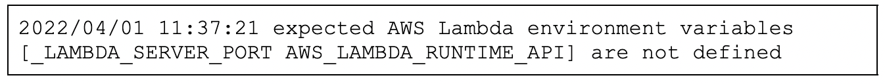
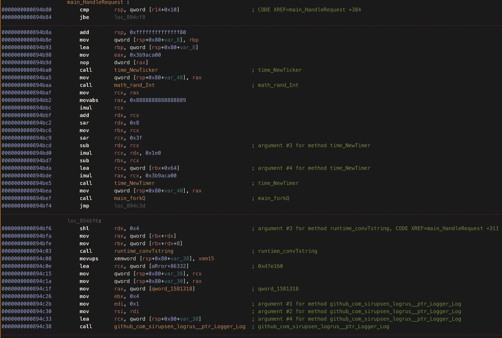
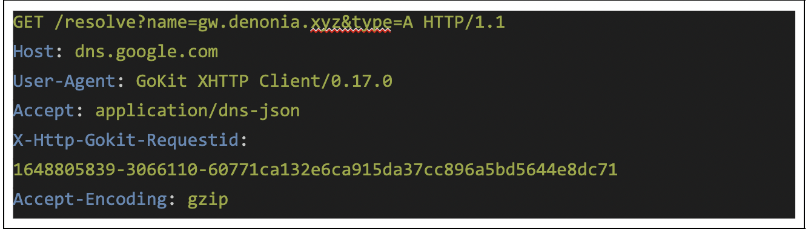
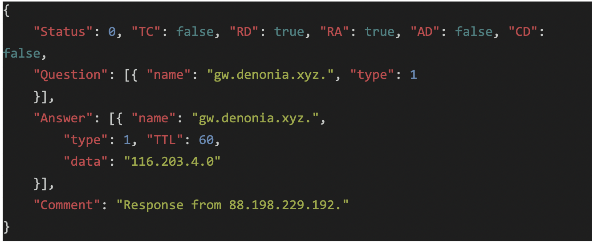
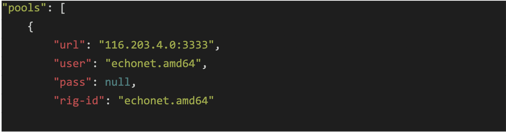
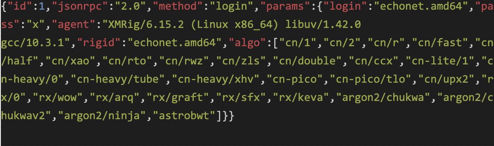
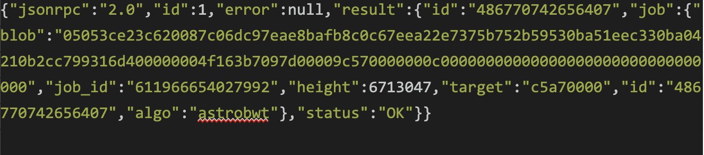
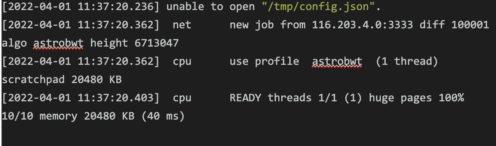

##### 6 Апреля, 2022
[original link](https://www.cadosecurity.com/cado-discovers-denonia-the-first-malware-specifically-targeting-lambda/)

### Cado обнаруживает Denonia: первое вредоносное ПО, специально нацеленное на Lambda

<i>Автор Мэтт Мьюир (Matt Muir), с благодарностью Крису Доману (Chris Doman), 
Элу Карри (Al Carchrie) и Полу Скотту (Paul Scott).</i>

Организации — как крупные, так и малые — все чаще используют бессерверные лямбда-функции. С точки зрения гибкости бизнеса бессерверные решения имеют значительные преимущества. Lambda также дает преимущества в плане безопасности — управляемая среда выполнения уменьшает поверхность атаки по сравнению с более традиционной серверной средой. Однако короткая 
продолжительность выполнения, огромное количество выполнений, а также динамическая и эфемерная природа лямбда-функций могут затруднить обнаружение, расследование и реагирование на потенциальные компрометацию. В соответствии с моделью AWS Shared Responsibility AWS обеспечивает безопасность базовой среды выполнения Lambda, но клиент сам должен защищать функции.

Cado Labs регулярно анализирует облачные окружения в поисках новейших угроз.
В рамках продолжающегося исследования мы обнаружили первый публично известный случай вредоносного ПО, специально разработанного для выполнения в среде AWS Lambda. Мы назвали эту вредоносную программу Denonia в честь имени домена, с которым она взаимодействует. Вредоносная программа использует новые методы разрешения адресов для командования и управления трафиком, чтобы обойти типичные меры обнаружения и контроля доступа к виртуальной сети.
Хотя этот первый пример довольно безобиден в том смысле, что в нем используется только программное обеспечение для крипто-майнинга, он демонстрирует, как злоумышленники используют передовые знания, относящиеся к облаку, для использования сложной облачной инфраструктуры, и указывает на потенциальные будущие, более гнусные атаки. Судя по телеметрии, которую мы видели, распространение Denonia до сих пор было ограниченным.

#### Технический анализ

Сперва мы столкнулись с образцом Denonia со следующей SHA-256 хэш-суммой:
[a31ae5b7968056d8d99b1b720a66a9a1aeee3637b97050d95d96ef3a265cbbca](https://www.virustotal.com/gui/file/a31ae5b7968056d8d99b1b720a66a9a1aeee3637b97050d95d96ef3a265cbbca)

Несмотря на то, что у него есть имя файла “python”, вредоносная программа на самом деле написана на Go и, похоже, содержит настраиваемый вариант программного обеспечения для майнинга XMRig наряду с другими неизвестными функциями. Мы решили продолжить расследование.

Во время динамического анализа вредоносная программа быстро остановила выполнение и зарегистрировала следующую ошибку:

Это вызвало наш интерес, поскольку эти переменные среды специфичны для Lambda, что дает нам некоторые подсказки о среде, в которой ожидается выполнение этой вредоносной программы. Просмотрев двоичный файл дальше, мы увидели, что это 64-разрядный исполняемый файл ELF, ориентированный на архитектуру x86-64, и что он использует ряд сторонних библиотек, в том числе [одну](https://github.com/aws/aws-lambda-go) специально для обеспечения выполнения в средах AWS Lambda.

#### Заметка о вредоносном ПО на Go

Вредоносные программы, написанные на языке программирования Go от Google, в последние годы становятся все [более распространенными](https://www.zdnet.com/article/go-malware-is-now-common-having-been-adopted-by-both-apts-and-e-crime-groups/). 
Этот язык привлекателен для разработчиков вредоносных программ по ряду причин, включая простоту, с которой он может создавать кросс-совместимые исполняемые файлы, и эффективное развертывание, которое обеспечивают статически связанные двоичные файлы. Однако эти характеристики языка могут создать некоторые проблемы для исследователей вредоносных программ, анализирующих двоичные 
файлы, скомпилированные из Go.

Во-первых, статически связанные двоичные файлы обычно намного больше, чем динамически связанные - это делает статический анализ немного более трудоемким. Go также обрабатывает строки необычным способом. Строки не заканчиваются нулем, как в C-подобных языках, вместо этого они хранятся в большом двоичном объекте, а при объявлении создается структура, которая включает в себя как указатель на строку в двоичном объекте, так и целое число, определяющее его длину. Это может сбить с толку некоторые инструменты статического анализа.

#### Анализ Lambda-малвари
Анализ бинарного файла для запуска в AWS Lambda создаёт некоторые интересные проблемы.

Хотя Denonia явно предназначена для исполнения внутри Labda-окружения, мы пока не знаем, как это будет доставлено. Это может быть просто вопрос компрометации доступа AWS и секретных ключей, а затем ручного развертывания в скомпрометированных средах Lambda, как мы уже [видели ранее](https://twitter.com/jonnyplatt/status/1470714913098289153) с более простыми скриптами на Python.

Используя [redress tool](https://github.com/goretk/redress), мы выявили несколько интересных сторонних библиотек Go, которые внедряет вредоносная программа. Это дало нам некоторые подсказки о его функциональности:
-   **github.com/aws/aws-lambda-go/lambda** – библиотеки, образцы и инструменты для написания Lambda-функций на Go
-   **github.com/aws/aws-lambda-go/lambdacontext** – помощники для извлечения контекстной информации из запроса Lambda invoke
-   **github.com/aws/aws-sdk-go/aws** – главный AWS SDK для Go
-   **github.com/likexian/doh-go** – DNS поверх HTTPS в Go, поддерживает таких провайдеров как: Quad9, Cloudflare etc

Ниже мы можем увидеть фрагмент обработчика лямбда-функции, который ожидает, что будут установлены определенные данные:


Несмотря на наличие этого, во время динамического анализа мы обнаружили, что образец с радостью продолжит выполнение вне лямбда-среды (т. е. в коробке Amazon Linux). Мы подозреваем, что это, вероятно, связано с “бессерверными” средами Lambda, использующими Linux под капотом, поэтому вредоносная ПРОГРАММА считала, что она запускается в Lambda (после того, как мы вручную установили необходимые переменные среды), несмотря на то, что она была запущена в нашей песочнице.

#### DNS поверх HTTPS
Обычно, когда вы запрашиваете доменное имя, например google.com , вы отправляете незашифрованный DNS–запрос, чтобы найти IP-адрес, который разрешает домен, чтобы ваш компьютер мог подключиться к домену. Относительно современной заменой традиционному DNS является DNS по протоколу HTTPS (DoH). DoH шифрует DNS-запросы и отправляет запросы в виде обычного HTTPS-трафика на преобразователи DoH.

Использование DoH - довольно необычный выбор для авторов Denonia, но здесь он дает два преимущества:
- AWS не может видеть запросы dns для вредоносного домена, что снижает вероятность обнаружения
- В некоторых Lambda-окружениях может быть невозможно выполнить поиск DNS, в зависимости от настроек VPC.

Мы можем видеть, как вредонос отправляет эти запросы с помощью библиотеки “doh-go” на такие URL-адреса, как:
- https://cloudflare-dns.com/dns-query?name=gw.denonia.xyz&type=A
- https://dns.google.com/resolve?name=gw.denonia.xyz&type=A


И сервер DoH (в данном случае от Google) который отвечает IP-адресом домена в формате JSON:


#### Запишем это в /tmp/.xml.json для XMRig
Контролируемый злоумышленником домен gw.denonia[.]xyz преобразуется в 116.203.4[.]0, который затем записывается в конфигурационный файл для xmrig по адресу /tmp/.xmrig.json:


Обратите внимание, что в AWS Lambda единственной директорией, в которую вы можете записывать, является /tmp. Двоичный файл также устанавливает домашнюю директорию в /tmp с помощью “HOME=/tmp”. Сама установка XMRig выполняется из памяти.

#### Взаимодействие с сервером Monero по адресу 116.203.4[.]0

Затем Denonia запускает XMRig из памяти и связывается с подконтрольным злоумышленнику майнинг-пулом по адресу 116.203.4[.]0:3333:


Который отвечает статусом задачи майнинга:



так же XMRig во время выполнения пишет в консоль:


#### Больше образцов
Интересно, что это не единственный образец Denonia. В то время как первый образец, который мы рассмотрели, датируется концом февраля, мы также нашли [второй образец](https://www.virustotal.com/gui/file/739fe13697bc55870ceb35003c4ee01a335f9c1f6549acb6472c5c3078417eed), который был загружен в VirusTotal в январе 2022 года:
- 739fe13697bc55870ceb35003c4ee01a335f9c1f6549acb6472c5c3078417eed

Следите за обновлениями для получения дополнительных блогов о Lambda-малвари!

#### Исследование AWS Lambda окружения
На этой неделе мы добавили возможность исследовать и исправлять AWS ECS и AWS Lambda environments в Cado Response.

Вы можете получить [бесплатное руководство по расследованию и реагированию на компрометацию в ECS здесь](https://offers.cadosecurity.com/securing-and-investigating-aws-ecs), а также [бесплатную пробную версию самой платформы здесь](https://www.cadosecurity.com/free-investigation/).

Для большей безопасности AWS Lambda-окружения, смотрите [Whitepaper для AWS](https://docs.aws.amazon.com/whitepapers/latest/security-overview-aws-lambda/security-overview-aws-lambda.pdf).

#### Индикаторы компрометации
```
rule lambda_malware
{
    meta:
        description = "Detects AWS Lambda Malware"
        author = "cdoman@cadosecurity.com"
        license = "Apache License 2.0"
        date = "2022-04-03"
        hash1 = "739fe13697bc55870ceb35003c4ee01a335f9c1f6549acb6472c5c3078417eed"
        hash2 = "a31ae5b7968056d8d99b1b720a66a9a1aeee3637b97050d95d96ef3a265cbbca"
    strings:
        $a = "github.com/likexian/doh-go/provider/"
        $b = "Mozilla/5.0 (compatible; Ezooms/1.0; help@moz.com)"
        $c = "username:password pair for mining server"
    condition:
        filesize < 30000KB and all of them
}
```

#### **IOCs**

  

| SHA256 |  |
| ----------------- | ------------------------------------------------------------------ |
|  |739fe13697bc55870ceb35003c4ee01a335f9c1f6549acb6472c5c3078417eed |
|  |a31ae5b7968056d8d99b1b720a66a9a1aeee3637b97050d95d96ef3a265cbbca|

| Domains |  |
| ----------------- | ------------------------------------------------------------------ |
|  |denonia[.]xyz|
|  |ctrl.denonia[.]xyz|
|  |gw.denonia[.]xyz|
|  |1.gw.denonia[.]xyz|
|  |www.denonia[.]xyz|
|  |xyz.denonia[.]xyz|
|  |mlcpugw.denonia[.]xyz|

| IP Addresses |  |
| ----------------- | ------------------------------------------------------------------ |
|  |116.203.4[.]0|
|  |162.55.241[.]99|
|  |148.251.77[.]55|